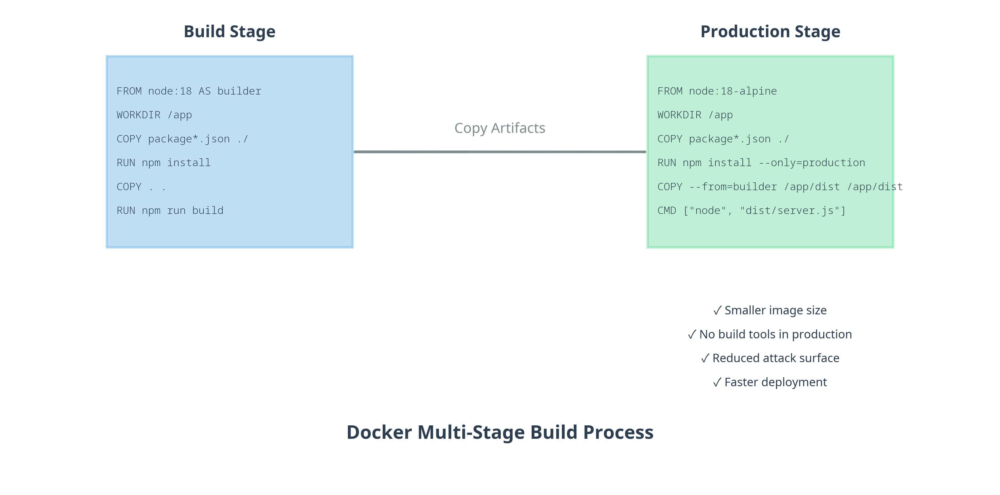
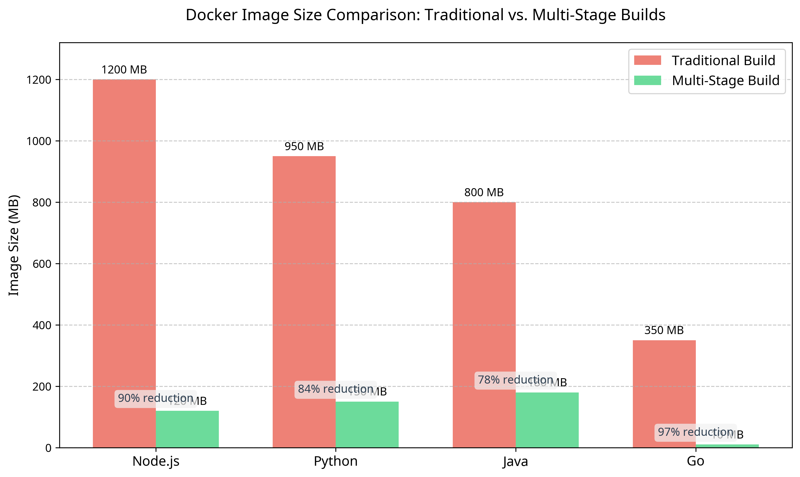

# Docker Multi-Stage Build Examples

This repository contains practical examples of Docker multi-stage builds across multiple programming languages. It demonstrates how multi-stage builds can significantly reduce image size, improve security, and speed up deployments.

## What Are Multi-Stage Builds?

Multi-stage builds allow you to use multiple FROM statements in your Dockerfile. Each FROM statement begins a new stage that can selectively copy artifacts from previous stages, leaving behind everything else.

The key benefits include:

- **Smaller image sizes**: Only include what's needed for runtime
- **Reduced attack surface**: Fewer packages mean fewer vulnerabilities
- **Faster deployments**: Smaller images deploy and start faster
- **Cleaner Dockerfiles**: Separate build and runtime concerns



## Examples Included

This repository includes examples for:

| Language | Traditional Size | Multi-Stage Size | Reduction |
| -------- | ---------------- | ---------------- | --------- |
| Go       | ~1.13GB          | ~9.08MB          | ~99.2%    |
| Node.js  | ~1.14GB          | ~130MB           | ~88.6%    |
| Python   | ~1.34GB          | ~250MB           | ~81.3%    |
| Java     | ~1.4GB           | ~297MB           | ~78.8%    |



## Repository Structure

```
docker-multistage-examples/
├── diagrams/             # Visual documentation (flow diagrams, charts)
├── scripts/              # Automation scripts
│   ├── demo.sh          # Main demo script (recommended)
│   ├── build-and-compare.sh # Detailed build comparison
│   └── run-examples.sh  # Run applications after building
├── advanced/             # Advanced Dockerfile examples
├── nodejs/               # Node.js 18 + Express example
├── python/               # Python 3.11 + Flask + Poetry example
├── java/                 # Java 17 + Spring Boot + Maven example
├── golang/               # Go 1.23 example
└── Documentation files   # README.md, SIZE_COMPARISON.md, etc.
```

Each language directory contains:

- A working web application with API endpoints
- **Traditional Dockerfile** (single-stage) - shows the "before" state
- **Multi-stage Dockerfile** (Dockerfile.secure) - optimized version
- Language-specific README with detailed instructions
- .dockerignore file with best practices
- Package manager files (package.json, pom.xml, pyproject.toml, go.mod)

## Getting Started

### Prerequisites

- Docker installed on your machine
- Git (to clone this repository)

### Quick Start

1. Clone this repository:

   ```bash
   git clone <repository-url>
   cd docker-multistage-examples
   ```

2. **Run the complete demo** (recommended):

   ```bash
   ./scripts/demo.sh
   ```

3. **Alternative: Build and compare with detailed output**:

   ```bash
   ./scripts/build-and-compare.sh
   ```

4. **Run all applications** (after building):

   ```bash
   ./scripts/run-examples.sh
   ```

5. Access the applications:

   - Node.js: <http://localhost:3000>
   - Python: <http://localhost:8000>
   - Java: <http://localhost:8080>
   - Go: <http://localhost:8081>

   Each application provides the same REST API endpoints:

   - `GET /api/items` - List all items
   - `GET /api/items/{id}` - Get a specific item
   - `POST /api/items` - Create a new item

## Scripts Overview

This project includes three automation scripts:

### `./scripts/demo.sh` - Main Demo Script

The primary script - run this for the complete demonstration

- Builds all Docker images (traditional + multistage) for all languages
- Displays impressive size comparison results with percentages
- Clean, formatted output perfect for presentations
- Silent builds for faster execution

### `./scripts/build-and-compare.sh`

Detailed build script with verbose output

- Color-coded output with build progress
- Individual language-by-language results
- Useful for debugging build issues
- Shows detailed Docker build logs

### `./scripts/run-examples.sh`

Application runner for testing

- Runs all built multistage containers as web services
- Maps appropriate ports for each language
- Provides API endpoint documentation
- Includes health checks and error handling

## Language-Specific Instructions

Each language directory contains its own README with detailed instructions for:

- Building traditional and multi-stage images
- Running the application
- Comparing image sizes
- Local development

## Technologies Used

This project demonstrates multistage builds across multiple technology stacks:

### Programming Languages & Frameworks

- **Node.js 18** with Express.js 4.18.2
- **Python 3.11** with Flask 2.3.2 and Poetry package management
- **Java 17** with Spring Boot 3.1.0 and Maven build tool
- **Go 1.23** with built-in HTTP server

### Docker Base Images

- **Traditional builds**: Full development images (golang:1.23, node:18, python:3.11, maven:3.8-openjdk-17)
- **Multistage builds**: Minimal runtime images (scratch, alpine, slim variants, JRE-only)

### Build Tools & Package Managers

- **Node.js**: npm with package.json
- **Python**: Poetry with pyproject.toml and lock files
- **Java**: Maven with pom.xml
- **Go**: Go modules with go.mod

## Advanced Techniques

The examples demonstrate several advanced multi-stage build techniques:

- Using build arguments across stages
- Creating debug variants
- Optimizing layer caching
- Using minimal base images (Alpine, distroless, scratch)

## Actual Results

When you run `./scripts/demo.sh`, you'll see these actual size reductions:

- **Go**: 1.13GB → 9.08MB (**99.2% reduction**)
- **Node.js**: 1.14GB → 130MB (**88.6% reduction**)
- **Python**: 1.34GB → 250MB (**81.3% reduction**)
- **Java**: 1.4GB → 297MB (**78.8% reduction**)

These aren't theoretical numbers - they're reproducible results you can achieve by running the demo script.

For detailed analysis of these results, see [SIZE_COMPARISON.md](SIZE_COMPARISON.md).

## Troubleshooting

### Common Build Issues

**Docker build fails with "No space left on device":**

- Run `docker system prune -a` to clean up unused images and build cache
- Ensure you have sufficient disk space (at least 5GB recommended)

**Go build fails with module errors:**

- Ensure you're using a supported Go version (1.23+)
- Check that `go.mod` dependencies are compatible with your Go version

**Java build fails with Maven errors:**

- Verify internet connectivity for downloading dependencies
- Clear Maven cache if needed: `docker run --rm -v ~/.m2:/root/.m2 maven:3.9-openjdk-17 mvn dependency:purge-local-repository`

**Permission errors on scripts:**

- Make scripts executable: `chmod +x scripts/*.sh`
- On Windows, use Git Bash or WSL for script execution

### Getting Help

- Check individual language README files for specific troubleshooting
- Review Docker logs: `docker logs <container-name>`
- Ensure all required files are present and not in `.dockerignore`

## Contributing

Contributions are welcome! Please feel free to submit a Pull Request.

## License

This project is licensed under the MIT License - see the LICENSE file for details.

## Acknowledgments

- Docker documentation on [multi-stage builds](https://docs.docker.com/build/building/multi-stage/)
- The Docker community for sharing best practices
